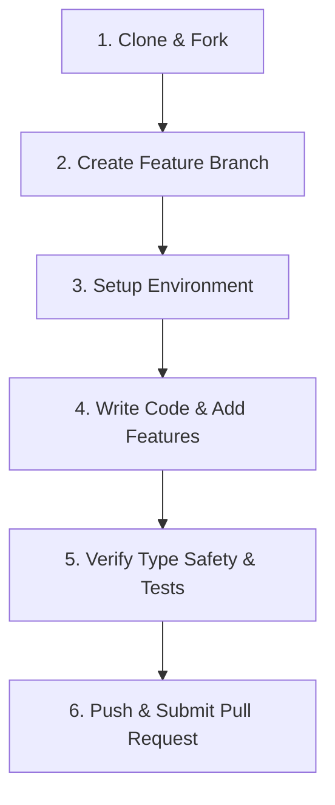

# 🤝 Contributing to AI Trip Planner

Welcome! We are excited that you want to contribute to the **AI Trip Planner** (Yatra). By contributing to this project, you help make travel planning more accessible, intelligent, and secure for everyone.

Please take a moment to review this guide to ensure a smooth, secure, and productive contribution workflow.

---

## 🗺️ Developer Onboarding Roadmap



---

## 🚀 Setting Up Your Development Environment

### 1. Clone & Branch
Always create a feature branch off of the `main` branch. Avoid working directly on `main`.
```bash
git checkout main
git pull origin main
git checkout -b feature/your-awesome-feature
```

### 2. Environment Variables Setup
Copy the template environment file to the root of the project:
```bash
cp .env.example .env
```
Fill in all required development APIs (Supabase URL, Anon Key, Groq API key, etc.).
> [!IMPORTANT]
> **NEVER commit your local `.env` file**. The root `.gitignore` is configured to ignore `.env`, but always double-check your staging status before committing.

### 3. Frontend Setup (Next.js 16)
Navigate to the root directory and install dependencies:
```bash
npm install
npm run dev
```
The frontend is available at `http://localhost:3000`.

### 4. Backend Setup (FastAPI + LangGraph)
Navigate to the backend directory and set up a Python virtual environment:
```bash
cd trip-planner-backend
python -m venv .venv

# Activate Virtual Environment:
# On Windows (PowerShell):
.venv\Scripts\activate
# On Mac/Linux:
source .venv/bin/activate

pip install -r requirements.txt
python -m playwright install
uvicorn main:app --reload --port 8000
```
FastAPI interactive documentation will be running at `http://localhost:8000/docs`.

---

## 🛠️ Code Standards & Verification

Before submitting a Pull Request, you **must** verify your code against our standard quality checks:

### 1. Frontend Type Safety Check
Ensure there are no TypeScript build or compile-time compilation errors:
```bash
npx tsc --noEmit
```
**We enforce a strict 0-warning compilation pass on all PRs.**

### 2. Backend Automated Test Suite
Make sure your changes do not break any existing integrations, scraper systems, or RAG models:
```bash
pytest tests/test_smart_scraper.py
```
All unit and integration tests must pass cleanly.

---

## 🛡️ Security Guidelines

Because this application relies on LLMs, dynamic caches, and Supabase database interactions, please follow these security practices:

- **No Plaintext Passwords / API Keys**: Do not write credentials in tests, changelogs, mock scripts, or comments. Use `.env` or temporary system variables.
- **Fail-Closed Admin Endpoints**: When writing scraper controls or admin routers, always fail-closed if security secret variables are unset.
- **Rate-Limiting Aware**: If you add a new public API endpoint, always wrap it with the in-memory sliding rate limiter (`src/lib/rate-limit.ts`) to avoid bot spamming.
- **Row Level Security (RLS)**: If you add new database tables in your migrations, you must enable RLS using `ALTER TABLE ... ENABLE ROW LEVEL SECURITY;` and write strict access policies.

---

## 📝 Commit Message Guidelines

We use [Conventional Commits](https://www.conventionalcommits.org/) to maintain a clean git history:

- `feat:` A new user-facing feature.
- `fix:` A bug fix.
- `docs:` Documentation-only changes (like updating README or this guide).
- `style:` Code formatting, styling, missing semicolons (no logic changes).
- `refactor:` Code change that neither fixes a bug nor adds a feature.
- `test:` Adding missing tests or correcting existing tests.
- `chore:` Updating build tasks, dependencies, git configs, etc.

*Example*: `feat: add glassmorphism timeline weather card widget`

---

## 📬 Submitting a Pull Request

1. Push your branch to GitHub:
   ```bash
   git push origin feature/your-awesome-feature
   ```
2. Open a Pull Request from your branch to `main`.
3. Provide a clear explanation of:
   - What features or fixes were implemented.
   - Any UX screenshots or videos if styling changed.
   - Confirmation that both `npx tsc --noEmit` and `pytest` passed.
4. Request review from a maintainer!

Thank you for helping us build the ultimate AI Travel experience! Happy coding! ✈️🌍
