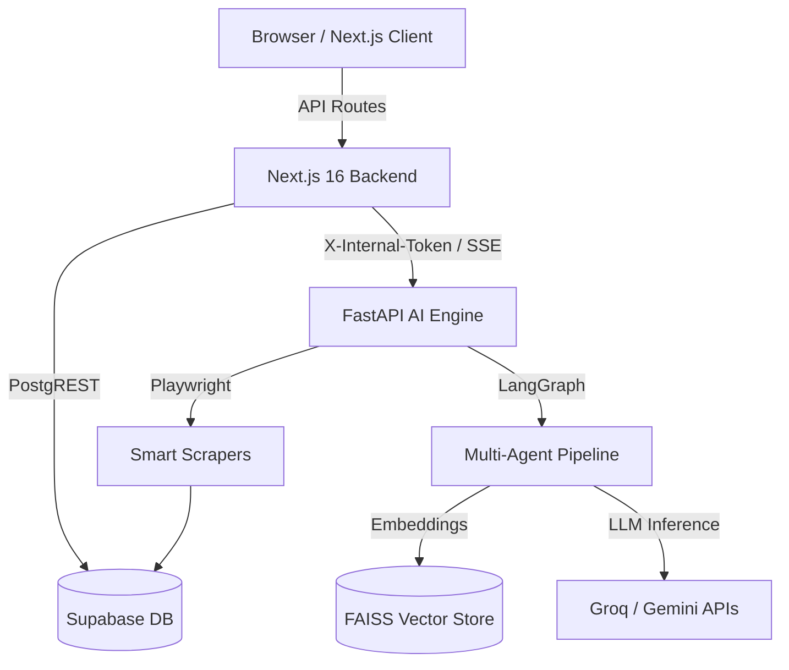

# 🌍 AI Trip Planner (Karyakram)

A next-generation, deeply integrated AI-powered travel planning application. It leverages a **Next.js 16** frontend and a **FastAPI + LangGraph** Multi-Agent backend to generate personalized, day-by-day itineraries, curate hotel recommendations, and discover local attractions in real-time.

---

## 🌟 Key Features

### 1. Frictionless Anonymous Planning
- **Explore Before Committing**: Users can define their budget, travel dates, and select hotels and custom attractions completely anonymously.
- **Seamless Auth Migration**: A premium, glassmorphic `AuthModal` intercepts the user right before the final itinerary generation. Upon Google SSO or email authentication, the system seamlessly migrates all locally cached (`localStorage`) preferences into the secure Supabase database without losing any context.

### 2. Multi-Agent RAG Orchestrator (LangGraph)
- **Cascading LLM Engine**: Intelligently falls back between Groq Llama-3 70B (High Quality), Groq 8B (Speed), and Google Gemini 2.0 Flash Lite (Rate Limit Safety).
- **RAG-Powered Authenticity**: Validates AI hallucinations by grounding itineraries in authentic, real-world data scraped dynamically from top travel sources (TripAdvisor, Hostelworld) and stored in a FAISS vector index.
- **Real-Time SSE Streaming**: As the LangGraph agents (Weather, Flight, Hotel, Budget, Itinerary) work on the backend, they pipe live updates and the final generated day-by-day itinerary directly to the browser via Server-Sent Events (SSE).

### 3. Smart Scraper Engine
- **On-Demand Discovery**: If a user requests a city that doesn't exist in our database, the FastAPI backend automatically spawns a background `Playwright` scraping agent to fetch authentic places, entry fees, and hotels, caching them into Supabase for future users.

### 4. Interactive & Premium UI/UX
- **Interactive Day-by-Day Timeline**: Features vibrant weather badges, lilac timeline actions, rating tags, and cost estimates.
- **Local Trip Tools**: Includes integrated side-drawers for Metro Maps, Street Food Guides, Local Language Phrases, Emergency Contacts, and Packing Checklists.
- **Memories Gallery**: Users can upload and manage photos from their completed trips directly to their dashboard.

---

## 🏗️ System Architecture

The application is built on a decoupled, highly scalable architecture ensuring clear separation of concerns between client presentation, AI orchestration, and data persistence.



### Flow of Data:
1. **Frontend Proxying**: The Next.js frontend securely proxies complex AI requests to the FastAPI backend, shielding internal endpoints from the public internet.
2. **LangGraph State Management**: The FastAPI backend spins up a stateful graph. Specialized agents (Budget Agent, Itinerary Agent, Validator Node) pass the `TripState` context between each other.
3. **Database Security**: Supabase acts as the central nervous system, strictly enforcing Row Level Security (RLS) policies to ensure users can only access their own trips, while the backend utilizes secure caching tables.

---

## 🛠️ Technology Stack

### Frontend
- **Framework**: Next.js 16 (App Router)
- **Library**: React 19
- **Styling**: Tailwind CSS + Shadcn UI
- **Animations**: Framer Motion
- **State/Auth**: Supabase SSR Client

### Backend (AI & Orchestration)
- **Framework**: FastAPI (Python 3.13)
- **AI Orchestration**: LangGraph, LangChain
- **LLM Providers**: Groq (Llama-3), Google Gemini
- **Vector Store**: FAISS
- **Web Scraping**: Playwright, BeautifulSoup4

### Database & Auth
- **BaaS**: Supabase (PostgreSQL)
- **Security**: Strict Row Level Security (RLS) policies

---

## 🛡️ Enterprise-Grade Security

- **In-Memory Rate Limiting**: Next.js API routes (`/generate`, `/generate-stays`, `/places/search`) are protected by a sliding-window IP rate limiter to prevent bot abuse and LLM token exhaustion.
- **Internal Microservice Auth**: Next.js communicates with FastAPI via a strictly validated `X-Internal-Token`, preventing malicious internet actors from directly hitting the expensive backend AI nodes.
- **Fail-Closed Admin Routes**: Scraper trigger endpoints explicitly validate an `ADMIN_SECRET` environment variable and will gracefully fail-closed if the environment is misconfigured.
- **Row Level Security (RLS)**: The Supabase database enforces zero-trust data access. Public RAG caches are tightly regulated, and user PII/trips are completely isolated.

---

## 🚀 Getting Started

### Prerequisites
- Node.js (v20+)
- Python (v3.12+)
- Git

### 1. Clone the Repository
```bash
git clone https://github.com/your-org/trip-planner.git
cd trip-planner
```

### 2. Environment Setup
Copy the template file to create your local environment configuration:
```bash
cp .env.example .env
```
Fill in all required API keys (Supabase, Groq, Gemini, etc.) inside `.env`. The backend is uniquely configured to read from this root `.env` file!

### 3. Frontend Setup
```bash
npm install
npm run dev
```
The Next.js application will start on `http://localhost:3000`.

### 4. FastAPI Backend Setup
Open a new terminal window:
```bash
cd trip-planner-backend
python -m venv .venv

# Windows
.venv\Scripts\activate
# Mac/Linux
source .venv/bin/activate

pip install -r requirements.txt
python -m playwright install

uvicorn main:app --reload --port 8000
```
The FastAPI documentation (Swagger) will be available at `http://localhost:8000/docs`.

---

## 📂 Folder Structure

```text
Trip_planner/
├── .env                  # Unified environment variables
├── package.json          # Next.js dependencies
├── supabase-migrations/  # SQL schemas, RLS policies, and triggers
├── src/                  # Next.js Frontend
│   ├── app/              # App Router, API proxies, and Pages
│   ├── components/       # Reusable UI components (Shadcn, Drawers, Modals)
│   ├── lib/              # AI fallbacks, Rate limiters, Supabase clients
│   └── config/           # Static data configs
└── trip-planner-backend/ # Python AI Backend
    ├── agents/           # Specialized LangGraph nodes
    ├── core/             # Base settings and Pydantic models
    ├── graph/            # Multi-Agent State and Orchestrator logic
    ├── rag/              # Retrieval Augmented Generation utilities
    ├── routers/          # FastAPI API routes
    ├── scrapers/         # Playwright background workers
    └── vector_store/     # FAISS database operations
```
