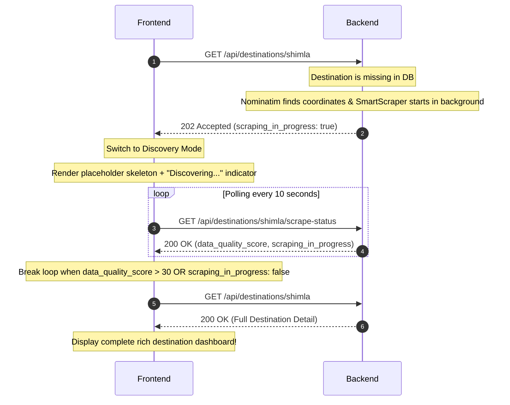

# Frontend-Backend API Contract

This document provides a comprehensive integration contract for connecting the Next.js frontend to the FastAPI backend. It is designed to be clear, strictly typed, and completely unambiguous.

---

## SECTION 1 — BASE URL AND AUTH

### Base URLs
* **Local Development**: `http://localhost:8000`
* **Production**: `https://backend.railway.app` (Placeholder - replace with actual Railway deployment)

### Authentication
* **Provider**: Supabase Auth (JWT-based).
* **Format**: All authenticated requests must include the JWT token in the HTTP `Authorization` header:
  ```http
  Authorization: Bearer <SUPABASE_JWT_TOKEN>
  ```
* **Endpoint Status**:
  * **Public Endpoints** (No token required):
    * `GET /health`
    * `GET /api/destinations`
    * `GET /api/destinations/{slug}`
    * `GET /api/destinations/compare`
    * `GET /api/destinations/{slug}/scrape-status`
    * `POST /api/plan` (Itinerary generation)
  * **Admin Protected Endpoints** (Requires `X-Admin-Secret` header, not JWT):
    * `GET /api/scraper/status`
    * `POST /api/scraper/trigger/{destination_slug}`
  * **User Protected Endpoints** (Planned - Will require Bearer Token):
    * `POST /api/trips`
    * `GET /api/trips/{id}`
    * `GET /api/trips/shared/{share_token}`
    * `PATCH /api/trips/{id}`
    * `DELETE /api/trips/{id}`

---

## SECTION 2 — ENVIRONMENT VARIABLES

Configure the following environment variables in your Next.js `.env.local` file:

```env
# URL of your FastAPI backend server
NEXT_PUBLIC_API_URL=http://localhost:8000

# Supabase Configurations for Frontend Client Authentication
NEXT_PUBLIC_SUPABASE_URL=https://your-supabase-project-id.supabase.co
NEXT_PUBLIC_SUPABASE_ANON_KEY=eyJhbGciOiJIUzI1NiIsInR5cCI6IkpXVCJ9...

# Admin secret header used to manually run scrapers during testing
NEXT_PUBLIC_ADMIN_SECRET=your_configured_admin_secret
```

---

## SECTION 3 — ENDPOINT REFERENCE

### 1. Health Check
* **METHOD**: `GET`
* **PATH**: `/health` *(Note: This is a root-level endpoint outside `/api`)*
* **Auth required**: No
* **Query parameters**: None
* **Response (200 OK)**:
  ```json
  {
    "status": "ok"
  }
  ```

---

### 2. Get Destinations (Filtered List)
* **METHOD**: `GET`
* **PATH**: `/api/destinations`
* **Auth required**: No
* **Query parameters**:
  * `category` (string, optional): Filter by type (e.g. `'heritage'`, `'beach'`, `'mountains'`)
  * `state` (string, optional): State name (e.g. `'Rajasthan'`, `'Kerala'`)
  * `budget_tier` (string, optional): Returns the average daily budget in INR for a specific level (`'budget'`, `'mid'`, `'premium'`)
  * `best_month` (integer, optional): The month index (1 to 12) during which to visit
  * `min_days` (integer, optional): Minimum recommended duration in days
  * `max_days` (integer, optional): Maximum recommended duration in days
  * `search` (string, optional): Free text matching on name/description
* **Response (200 OK)**:
  ```json
  {
    "destinations": [
      {
        "id": "c8b417e2-e1d5-455b-80df-8bf3cfa5d201",
        "slug": "jaipur",
        "name": "Jaipur",
        "state": "Rajasthan",
        "category": "heritage",
        "description": "The Pink City - known for Hawa Mahal, City Palace, Amber Fort and vibrant bazaars",
        "avg_daily_budget_inr": {
          "budget": 1500,
          "mid": 3500,
          "premium": 8000
        },
        "best_months": [10, 11, 12, 1, 2, 3],
        "avg_trip_duration_days": 3,
        "avg_daily_budget_tier": 3500,
        "data_freshness": null
      }
    ],
    "count": 1
  }
  ```

---

### 3. Get Destination Detail
* **METHOD**: `GET`
* **PATH**: `/api/destinations/{slug}`
* **Auth required**: No
* **Response (200 OK - Known Location)**:
  ```json
  {
    "destination": {
      "id": "c8b417e2-e1d5-455b-80df-8bf3cfa5d201",
      "slug": "jaipur",
      "name": "Jaipur",
      "state": "Rajasthan",
      "region": "North",
      "lat": 26.9124,
      "lon": 75.7873,
      "description": "The Pink City...",
      "category": "heritage",
      "best_months": [10, 11, 12, 1, 2, 3],
      "avg_trip_duration_days": 3,
      "difficulty": "easy",
      "avg_daily_budget_inr": {
        "budget": 1500,
        "mid": 3500,
        "premium": 8000
      },
      "nearest_airport_code": "JAI",
      "nearest_railway_station": "Jaipur Junction",
      "flight_hours_from": {"delhi": 1, "mumbai": 2},
      "is_active": true,
      "data_quality_score": 85,
      "scraped_at": "2026-05-18T04:12:00Z"
    },
    "places": [
      {
        "id": "ae32fca9-122e-4b47-8a1a-42c222ffda88",
        "destination_id": "c8b417e2-e1d5-455b-80df-8bf3cfa5d201",
        "name": "Amber Fort",
        "category": "Fort",
        "description": "Majestic hilltop fort featuring red sandstone and marble palaces.",
        "entry_fee_inr": 200,
        "duration_hours": 3.0,
        "best_time": "Morning",
        "tips": "Hire a guide at the entrance to learn about the Sheesh Mahal.",
        "lat": 26.9854,
        "lon": 75.8513,
        "source": "Wikipedia",
        "is_verified": true,
        "scraped_at": "2026-05-18T04:12:00Z"
      }
    ],
    "hotels": [
      {
        "id": "fa9128f7-cc1a-40a1-a4b0-31ccff78ee99",
        "destination_id": "c8b417e2-e1d5-455b-80df-8bf3cfa5d201",
        "name": "Zostel Jaipur",
        "locality": "Old City",
        "property_type": "Hostel",
        "price_min_inr": 800,
        "price_max_inr": 2500,
        "rating": 9.1,
        "review_count": 482,
        "amenities": ["Free Wi-Fi", "Rooftop Cafe", "Air Conditioning"],
        "source": "Hostelworld",
        "url": "https://www.hostelworld.com/pms/zostel-jaipur",
        "is_stale": false,
        "scraped_at": "2026-05-18T04:12:00Z"
      }
    ],
    "upcoming_events": [
      {
        "id": "e932ff11-1200-4b08-bcff-d12f45ccae01",
        "destination_id": "c8b417e2-e1d5-455b-80df-8bf3cfa5d201",
        "name": "Jaipur Literature Festival",
        "event_type": "Festival",
        "start_date": "2027-01-21T00:00:00Z",
        "end_date": "2027-01-25T00:00:00Z",
        "description": "The world's largest free literary festival.",
        "impact_on_travel": "High hotel bookings, early reservations recommended.",
        "is_recurring": true,
        "source": "Thrillophilia",
        "scraped_at": "2026-05-18T04:12:00Z"
      }
    ],
    "active_news": [],
    "blog_tips": [
      "Try the Pyaz Kachori at Rawat Mishtan Bhandar.",
      "Wear slip-on shoes since many temples require removing footwear."
    ],
    "local_insights": [
      "Jaipur is known as the Pink City due to the dominant color scheme of its historic buildings."
    ],
    "weather_cache": {
      "forecast_json": {
        "temp": 32.5,
        "humidity": 45,
        "condition": "Sunny"
      },
      "scraped_at": "2026-05-18T08:00:00Z"
    }
  }
  ```
* **Response (202 Accepted - Unknown Location Discovery Flow)**:
  *Occurs when a user queries a destination not currently registered in the database. Initiates background geocoding and scrapers.*
  ```json
  {
    "status": "discovering",
    "destination": "Shimla, Himachal Pradesh",
    "scraping_in_progress": true,
    "message": "Scraping pipeline initiated in background for shimla.",
    "data_quality_score": 0
  }
  ```
* **Response (404 Not Found - Fake/Invalid Location)**:
  *Occurs if the Nominatim geocoder fails to match the query to a real city.*
  ```json
  {
    "error": "Destination not found",
    "query": "xyzabcfakelocation"
  }
  ```

---

### 4. Side-by-Side Destination Comparison
* **METHOD**: `GET`
* **PATH**: `/api/destinations/compare`
* **Auth required**: No
* **Query parameters**:
  * `slugs` (string, required): Comma-separated list of slugs to compare (Max 3, e.g. `jaipur,udaipur`)
* **Response (200 OK)**:
  ```json
  {
    "comparisons": [
      {
        "name": "Jaipur",
        "category": "heritage",
        "state": "Rajasthan",
        "avg_daily_budget_inr": {
          "budget": 1500,
          "mid": 3500,
          "premium": 8000
        },
        "best_months": [10, 11, 12, 1, 2, 3],
        "avg_trip_duration_days": 3,
        "top_places_count": 18,
        "hotel_count": 22,
        "upcoming_events_count": 2,
        "difficulty": "easy",
        "nearest_airport_code": "JAI"
      }
    ]
  }
  ```

---

### 5. Check Scraper Polling Status
* **METHOD**: `GET`
* **PATH**: `/api/destinations/{slug}/scrape-status`
* **Auth required**: No
* **Response (200 OK)**:
  ```json
  {
    "slug": "jaipur",
    "is_active": true,
    "data_quality_score": 85,
    "places_count": 18,
    "hotels_count": 22,
    "last_scraped": "2026-05-18T04:12:00Z",
    "scraping_in_progress": false
  }
  ```

---

### 6. Create Travel Plan (SSE Itinerary Generation)
* **METHOD**: `POST`
* **PATH**: `/api/plan`
* **Auth required**: No
* **Request Body**:
  ```json
  {
    "destination": "Jaipur",
    "start_date": "2026-10-15",
    "end_date": "2026-10-18",
    "budget_usd": 300.00,
    "origin_city": "Delhi",
    "travelers": 2,
    "style": "balanced"
  }
  ```
* **Response**: Emits a Server-Sent Events (SSE) stream. Detailed consumption rules in Section 4.

---

### 7. Scraper Status (Admin View)
* **METHOD**: `GET`
* **PATH**: `/api/scraper/status`
* **Auth required**: Yes (Requires custom admin key header)
* **Headers**:
  * `X-Admin-Secret`: `your_admin_secret_string`
* **Response (200 OK)**:
  ```json
  {
    "jobs": [
      {
        "destination": "Jaipur",
        "destination_slug": "jaipur",
        "last_run": "2026-05-18T04:12:00.000000+00:00",
        "records_count": 40,
        "next_run": "2026-05-20T04:12:00.000000+00:00",
        "status": "active"
      }
    ]
  }
  ```

---

### 8. Manual Trigger Scraper (Admin Action)
* **METHOD**: `POST`
* **PATH**: `/api/scraper/trigger/{destination_slug}`
* **Auth required**: Yes (Requires custom admin key header)
* **Headers**:
  * `X-Admin-Secret`: `your_admin_secret_string`
* **Response (200 OK)**:
  ```json
  {
    "status": "accepted",
    "message": "Triggered SmartScraper for jaipur",
    "job_id": "smartscrape_jaipur"
  }
  ```

---

### 9. User Trips & Storage [PLANNED — NOT YET AVAILABLE]
The endpoints below represent features currently scheduled for development. They are not functional yet.
* **POST** `/api/trips` (Create/Save Trip)
* **GET** `/api/trips/{id}` (Get User Trip)
* **GET** `/api/trips/shared/{share_token}` (Get Shared Read-Only Itinerary)
* **PATCH** `/api/trips/{id}` (Update Trip)
* **DELETE** `/api/trips/{id}` (Delete Trip)

---

## SECTION 4 — SSE STREAMING (`POST /api/plan`)

The `/api/plan` endpoint utilizes a Server-Sent Events stream to deliver step-by-step progress and final itinerary details. Because browsers' default `EventSource` API does not support `POST` request bodies, the frontend must parse the stream manually using `fetch()` and `ReadableStream`.

### Stream Lifecycle Event Types

| Event Name | Data Schema | Description / Action Required |
|---|---|---|
| `status` | `{"agent": string, "status": "started"\|"done", "message": string}` | Emitted as agent components complete their individual operations. The frontend should display these as active loading text updates (e.g. "Fetching weather forecast..."). |
| `result` | Full JSON Itinerary (defined as `TripResponse` in Section 5) | Emitted once. Represents the complete generated travel guide. Cache this payload and construct the rich final dashboard layout with it. |

### Detecting Completion
The stream ends when the `ReadableStream` reader returns `{ done: true }`. There is no custom "completion" string event needed; standard stream exhaustion is the success indicator.

### TypeScript SSE Consumer Snippet

Below is a production-ready, fully robust helper utilizing generator loops for clean async processing in React/Next.js:

```typescript
export interface TripRequest {
  destination: string;
  start_date: string;
  end_date: string;
  budget_usd: number;
  origin_city: string;
  travelers: number;
  style: "budget" | "balanced" | "luxury";
}

export interface StatusUpdate {
  agent: string;
  status: "started" | "done";
  message: string;
}

export type SSEMessage = 
  | { event: "status"; data: StatusUpdate }
  | { event: "result"; data: any }; // Replace 'any' with final TripResponse interface

/**
 * Consumes the Server-Sent Events plan stream from the backend.
 * Yields parsed messages sequentially.
 */
export async function* streamPlan(request: TripRequest): AsyncGenerator<SSEMessage, void, unknown> {
  const response = await fetch(`${process.env.NEXT_PUBLIC_API_URL}/api/plan`, {
    method: "POST",
    headers: {
      "Content-Type": "application/json",
    },
    body: JSON.stringify(request),
  });

  if (!response.ok) {
    throw new Error(`Failed to generate itinerary. Server returned status code: ${response.status}`);
  }

  const reader = response.body?.getReader();
  if (!reader) {
    throw new Error("No readable stream reader available on the response.");
  }

  const decoder = new TextDecoder("utf-8");
  let buffer = "";

  try {
    while (true) {
      const { value, done } = await reader.read();
      if (done) break;

      buffer += decoder.decode(value, { stream: true });
      const lines = buffer.split("\n");
      
      // Save incomplete trailing line back to the buffer
      buffer = lines.pop() || "";

      let currentEvent: string | null = null;

      for (const line of lines) {
        const trimmed = line.trim();
        if (!trimmed) continue;

        if (trimmed.startsWith("event:")) {
          currentEvent = trimmed.replace("event:", "").trim();
        } else if (trimmed.startsWith("data:") && currentEvent) {
          const rawData = trimmed.replace("data:", "").trim();
          
          try {
            const parsedData = JSON.parse(rawData);
            
            if (currentEvent === "status") {
              yield { event: "status", data: parsedData as StatusUpdate };
            } else if (currentEvent === "result") {
              yield { event: "result", data: parsedData };
            }
          } catch (err) {
            console.error("Failed to parse SSE JSON payload:", rawData, err);
          }
          currentEvent = null; // Reset for next chunk
        }
      }
    }
  } finally {
    reader.releaseLock();
  }
}
```

---

## SECTION 5 — TYPE DEFINITIONS

Add these interfaces directly to a standard frontend `types/api.ts` file:

```typescript
export interface TripRequest {
  destination: string;
  start_date: string;
  end_date: string;
  budget_usd: number;
  origin_city: string;
  travelers: number;
  style: "budget" | "balanced" | "luxury";
}

export interface BudgetBreakdown {
  flights_estimated_inr: number;
  accommodation_estimated_inr: number;
  food_and_activities_estimated_inr: number;
  misc_buffer_inr: number;
  total_inr: number;
}

export interface DayActivity {
  time_of_day: "Morning" | "Afternoon" | "Evening";
  place_name: string;
  activity_description: string;
  entry_fee_inr: number;
  duration_hours: number;
}

export interface DayPlan {
  day_number: number;
  date: string;
  title: string;
  activities: DayActivity[];
}

export interface Itinerary {
  days: DayPlan[];
}

export interface TripResponse {
  destination_name: string;
  style: string;
  duration_days: number;
  budget_breakdown: BudgetBreakdown;
  itinerary: Itinerary;
  weather_summary: string;
  flight_recommendations: string[];
  local_insights: string[];
  data_freshness: string | null;
}

export interface DestinationCard {
  id: string;
  slug: string;
  name: string;
  state: string;
  category: string;
  description: string;
  avg_daily_budget_inr: {
    budget: number;
    mid: number;
    premium: number;
  };
  best_months: number[];
  avg_trip_duration_days: number;
}

export interface Place {
  id: string;
  destination_id: string;
  name: string;
  category: string;
  description: string;
  entry_fee_inr: number;
  duration_hours: number;
  best_time: string;
  tips: string;
  lat: number;
  lon: number;
  source: string;
  is_verified: boolean;
  scraped_at: string;
}

export interface Hotel {
  id: string;
  destination_id: string;
  name: string;
  locality: string;
  property_type: string;
  price_min_inr: number;
  price_max_inr: number;
  rating: number;
  review_count: number;
  amenities: string[];
  source: string;
  url: string;
  is_stale: boolean;
  scraped_at: string;
}

export interface LocalEvent {
  id: string;
  destination_id: string;
  name: string;
  event_type: string;
  start_date: string;
  end_date: string;
  description: string;
  impact_on_travel: string;
  is_recurring: boolean;
  source: string;
  scraped_at: string;
}

export interface NewsAlert {
  id: string;
  destination_id: string;
  title: string;
  content: string;
  severity: "info" | "warning" | "critical";
  category: string;
  published_at: string;
  expires_at: string;
  source: string;
}

export interface BlogGuide {
  key_tips: string[];
  local_insights: string[];
}

export interface WeatherForecast {
  forecast_json: {
    temp: number;
    humidity: number;
    condition: string;
    [key: string]: any;
  };
  scraped_at: string;
}

export interface DestinationDetail {
  destination: DestinationCard & {
    region: string;
    lat: number;
    lon: number;
    difficulty: string;
    nearest_airport_code: string;
    nearest_railway_station: string;
    flight_hours_from: Record<string, number>;
    is_active: boolean;
    data_quality_score: number;
    scraped_at: string;
  };
  places: Place[];
  hotels: Hotel[];
  upcoming_events: LocalEvent[];
  active_news: NewsAlert[];
  blog_tips: string[];
  local_insights: string[];
  weather_cache: WeatherForecast | null;
}

export interface CompareCard {
  name: string;
  category: string;
  state: string;
  avg_daily_budget_inr: {
    budget: number;
    mid: number;
    premium: number;
  };
  best_months: number[];
  avg_trip_duration_days: number;
  top_places_count: number;
  hotel_count: number;
  upcoming_events_count: number;
  difficulty: string;
  nearest_airport_code: string;
}

export interface ScrapeStatus {
  slug: string;
  is_active: boolean;
  data_quality_score: number;
  places_count: number;
  hotels_count: number;
  last_scraped: string | null;
  scraping_in_progress: boolean;
}

// Union type for SSE Plan Stream
export type SSEEvent =
  | { event: "status"; data: StatusUpdate }
  | { event: "result"; data: TripResponse };

// Planned Storage Type for Saved User Itineraries
export interface SavedTrip {
  id: string;
  user_id: string;
  share_token: string;
  trip_request: TripRequest;
  trip_response: TripResponse;
  created_at: string;
  updated_at: string;
}
```

---

## SECTION 6 — ON-DEMAND DESTINATION FLOW

When a user searches for an unrecognized city, the backend initiates a parallel, LLM-guided scrape of active platforms in the background. The frontend must implement a progressive discovery UI using polling to provide a seamless user experience.

### The Flow


### Polling Implementation (React Hook)

Use this complete custom hook to safely manage polling in your Next.js project:

```typescript
import { useEffect, useState } from "react";
import axios from "axios";
import { ScrapeStatus, DestinationDetail } from "../types/api";

const API_BASE = process.env.NEXT_PUBLIC_API_URL;

export function useDiscoverDestination(slug: string) {
  const [loading, setLoading] = useState(true);
  const [isDiscovering, setIsDiscovering] = useState(false);
  const [status, setStatus] = useState<ScrapeStatus | null>(null);
  const [data, setData] = useState<DestinationDetail | null>(null);
  const [error, setError] = useState<string | null>(null);

  useEffect(() => {
    let intervalId: NodeJS.Timeout;
    setLoading(true);
    setError(null);

    const checkDestination = async () => {
      try {
        const response = await axios.get(`${API_BASE}/api/destinations/${slug}`);
        
        if (response.status === 200) {
          setData(response.data);
          setLoading(false);
          setIsDiscovering(false);
        }
      } catch (err: any) {
        if (err.response && err.response.status === 202) {
          // Discovery flow triggered
          setIsDiscovering(true);
          setStatus(err.response.data);
          startPolling();
        } else {
          setError(err.response?.data?.error || "An unexpected error occurred.");
          setLoading(false);
        }
      }
    };

    const startPolling = () => {
      intervalId = setInterval(async () => {
        try {
          const statusResp = await axios.get<ScrapeStatus>(
            `${API_BASE}/api/destinations/${slug}/scrape-status`
          );
          
          setStatus(statusResp.data);

          // Standard quality threshold. Break loop when enough base data exists.
          if (statusResp.data.data_quality_score > 30 || !statusResp.data.scraping_in_progress) {
            clearInterval(intervalId);
            // Fetch final detailed payload
            const finalResp = await axios.get<DestinationDetail>(`${API_BASE}/api/destinations/${slug}`);
            setData(finalResp.data);
            setIsDiscovering(false);
            setLoading(false);
          }
        } catch (pollErr) {
          console.error("Error polling scrape status:", pollErr);
        }
      }, 10000); // 10s intervals
    };

    checkDestination();

    return () => {
      if (intervalId) clearInterval(intervalId);
    };
  }, [slug]);

  return { loading, isDiscovering, status, data, error };
}
```

---

## SECTION 7 — ERROR HANDLING

The API communicates errors via standard HTTP status codes. All errors returned by our custom logic (excluding FastAPI-level syntax validation errors) conform to a consistent JSON error shape.

### Error Payload Format
```typescript
interface APIError {
  error: string;
  query?: string;
  detail?: any; // Contains specific input validation arrays if 422
}
```

### HTTP Status Code Resolution Table

| Code | Trigger Scenario | Suggested Frontend User Message |
|---|---|---|
| `200` | Successful request. | N/A (Load page) |
| `202` | New location found via geocoder, scraping initiated. | "We are scouting this destination! Gathering fresh local insights, places, and hotels..." (Show loading spinner) |
| `400` | Missing query strings (e.g. comparison slugs omitted). | "Invalid query parameters. Please select at least two destinations to compare." |
| `401` | Unauthorized (Missing admin secret key). | "Access denied. Administrative authentication token is missing or invalid." |
| `404` | City slug does not exist and geocoder failed. | "We couldn't locate this destination. Please check the spelling or enter a larger nearby city." |
| `422` | Request body validation failure (e.g. negative budget, invalid date strings). | *Map and render individual validation error messages returned inside the `detail` object to corresponding inputs.* |
| `500` | Uncaught server-side failure. | "Our services are currently experiencing issues. Please try again in a few moments." |

---

## SECTION 8 — CORS

Cross-Origin Resource Sharing (CORS) is strictly configured on the FastAPI backend for security.

* **Allowed Origin**: The backend reads its origin directly from `settings.NEXT_JS_ORIGIN`. This is configured on the backend using the `.env` variable:
  ```env
  NEXT_JS_ORIGIN=http://localhost:3000
  ```
* **Ports**: If you run your Next.js application on a non-standard port (e.g., `http://localhost:3001` or `http://localhost:8080`), you **must** update the `NEXT_JS_ORIGIN` variable in the backend environment variables to match, otherwise the browser will block all network calls.
* **Headers**: Custom administrative triggers require the `X-Admin-Secret` custom header. This is fully allowed by the backend wildcard headers middleware.
